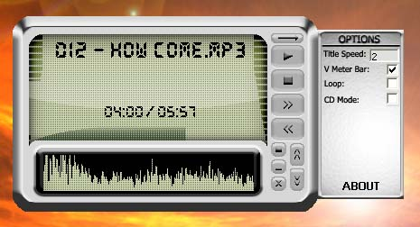



## MP3 player Great animations and GUI \(updated\)\(see screenshot\)

### Description

This is my first submission. Its an mp3 player(almost complete) that utilizes the fmod sound engine. The GUI is one of the best on psc for this type project. I submitted it in hopes of recieveing tips on coding and reports of any bugs it has, but if you like it or it gives you some ideas then throw me a vote.

UPDATE: I have uploaded a few additions such as tooltips, a few bug fixes, an audio balance control, and playlist support. Its still a little buggy but i wont be able to update for a while so i figured what the hell.

NOTE: I could not include the outdated fmod dll an ocx but thanks to Sebastian Mares they are now available at http://www.transilvania2000.com/fmod.zip

(case sensitive).
 
### More Info
 

             |
---                |---
**Submitted On**   |2004-07-28 23:28:32
**By**             |[J ATT](https://github.com/Planet-Source-Code/PSCIndex/blob/master/ByAuthor/j-att.md)
**Level**          |Beginner
**User Rating**    |5.0 (10 globes from 2 users)
**Compatibility**  |VB 3\.0, VB 4\.0 \(16\-bit\), VB 4\.0 \(32\-bit\), VB 5\.0, VB 6\.0, VB Script, ASP \(Active Server Pages\) , VBA MS Access, VBA MS Excel
**Category**       |[Sound/MP3](https://github.com/Planet-Source-Code/PSCIndex/blob/master/ByCategory/sound-mp3__1-45.md)
**World**          |[Visual Basic](https://github.com/Planet-Source-Code/PSCIndex/blob/master/ByWorld/visual-basic.md)
**Archive File**   |[MP3\_player1775257282004\.zip](https://github.com/Planet-Source-Code/j-att-mp3-player-great-animations-and-gui-updated-see-screenshot__1-55209/archive/master.zip)

